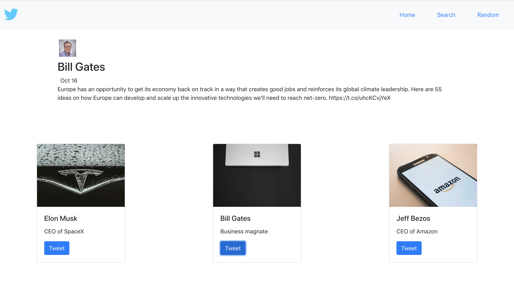

# Twitter-Showcase-app

This is a Twitter Showcase App written in HTML, CSS, Javascript, and NodeJs. It uses React, Bootstrap, ExpressJs as an internal API, and is deployed with Heroku.

<strong>View application on <a href="https://twitter-showcase-app-ml.herokuapp.com/"><b>Heroku</b></a>.</strong>

# Summary

This is my first full-stack application. The purpose of this app was to help me understand the entire full-stack process and hone in on my technical skills. Even though it took some time to understand how to connect to Twitter's API, it was one of the most satisfying project I've completed thus far. I learned about API's and authentication and got to work with the "Postman" application, which made the whole testing process easier and quicker.

In order to create this app, I first had to create the basic site (HTML/CSS). Next, I had to serve my website using Node/Express. I also used NPM scripts to set up a DEV environment. Finally, I had to create an internal API and figure out how to grab data from an external API.

# Author
<strong>Mauro Leos</strong>-<i>Full-Stack Software Developer</i>-<a href="https://www.linkedin.com/in/mauro-leos-b4103a11b/">LinkedIn</a>
